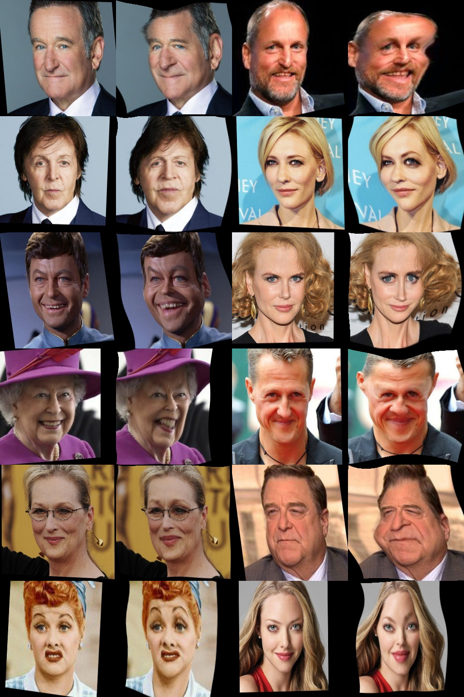

# CariGANs: Unpaired Photo-to-Caricature Translation

I remember seeing this project in the news in 2018 when it was published. I was immediately fascinated! This algorithm had managed to extract both the style and form of a work of caricature artist and apply it to an input image.

This is a series of notebooks aimed at understanding and replicating the CariGANs: Unpaired Photo-to-Caricature Translation paper by Kaidi Cao, Jing Liao, Lu Yuan.

https://ai.stanford.edu/~kaidicao/carigan.pdf


### Before Starting:

* Initially I wrote this series of notebooks purely for my own understanding, however I have since adapted them slightly so they can be followed by others.
* The workbooks will take you to the point where you can implement cariGeoGAN yourself. My current results can be seen below. 
* I am currently creating another series of notebooks for cariStyleGAN and plan to upload when they are complete. 
* The dataset used requires permission, you will need permission also, or gather a similar suitable dataset.


### Results of CariGeoGAN:

* I have currently only implemented cariGeoGAN which works on geometric deformation. I am yet to implement cariStyleGAN which works on style transfer. 
* Without the characteristic loss definied in the paper, interesting results can be obtained, which do resemble caricatures however the likeness to the invidividual is lost.
* See below results generated with characteristic loss



### Improvements:

* Experiment with different fully connected arcitectures to try and reduce cost functions further
* Include wider selection of faces in input dataset. Although the dataset is unparied, list of people in the faces and caricature datasets are the same. This should help the algorithm generalise better.
* Implement cariStyleGAN

### Environment:
You can create a conda environment with all required dependencies by running conda env create in the root of the repository. Install the environment with:

```
conda env create -f environment.yml
```

### Key References

* CariGAN paper: "CariGANs: Unpaired Photo-to-Caricature Translation" Kaidi Cao, Jing Liao, Lu Yuan. 
* Dataset: "WebCaricature: A Benchmark for Caricature Recognition" Jing Huo, Wenbin Li, Yinghuan Shi, Yang Gao, Hujun Yin
* CycleGAN Paper: "Unpaired Image-to-Image Translation using Cycle-Consistent Adversarial Networkssee" Jun-Yan Zhu.
* Tensorflow implementation of CycleGAN: https://github.com/xhujoy/CycleGAN-tensorflow

